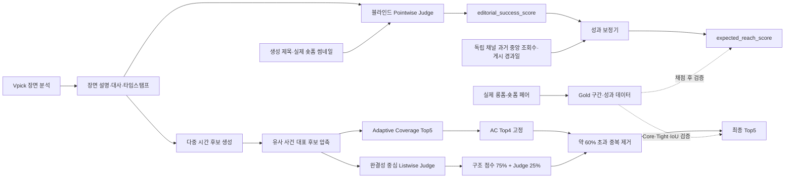

# Vpick 하이라이트 평가체계 구축 및 선택 개선

[](https://github.com/Ai-pre/Vpick/actions/workflows/ci.yml)

Vpick이 제공하는 장면 설명, 대사, 타임스탬프를 이용해 숏폼 후보를 평가하고,
서로 다른 사건을 담은 Top5를 구성하는 프로젝트입니다.

이 저장소는 두 문제를 분리해서 다룹니다.

1. **평가체계 구축**: 후보의 콘텐츠·패키징 품질을 블라인드 Pointwise
   LLM-as-a-Judge로 채점하고 실제 조회 성과와의 순위 정합성을 검증합니다.
2. **선택 개선**: Vpick 장면 데이터에서 여러 시간 구간을 생성한 뒤,
   Adaptive Coverage와 완결성 중심 Listwise Judge를 결합해 Top5를 구성합니다.

> 현재 결과는 94개 개발 데이터와 Vpick baseline을 함께 확보한 common18에서
> 얻은 개발 결과입니다. 최종 가중치와 common18 개선 수치는 신규 외부
> Holdout에서 검증된 일반화 성능으로 표현하지 않습니다.

## 최종 결과

### 평가체계

| 항목 | 결과 |
|---|---:|
| 데이터 | 6개 채널, 85개 롱폼, 94개 실제 숏폼 |
| 성과 구간 | HIGH 30 / MID 34 / LOW 30 |
| Pointwise 공식 | 변화·반전 40% + 제목 15% + 썸네일 45% |
| Pointwise 단독 원조회수 Spearman ρ | 0.212 |
| 성과 보정 후 Group OOF Spearman ρ | 0.430 |
| 성과 보정 후 후보 쌍 순서 일치율 | 64.4% |

Pointwise 공식 `40:15:45`는 현재 94개 결과를 확인한 뒤 선택했습니다.
사전 고정식 `50:25:25`의 보정 후 Group OOF Spearman ρ는 0.410입니다.

### 하이라이트 선택 개선

Vpick 결과와 동일하게 비교 가능한 17개 롱폼, 18개 Gold pair에서 측정했습니다.

| 방식 | Core@5 | Tight@5 | Best IoU@5 |
|---|---:|---:|---:|
| Vpick baseline | 5.6% | 5.6% | 0.060 |
| Judge-only | 22.2% | 22.2% | 0.181 |
| Adaptive Coverage | 50.0% | 50.0% | 0.361 |
| **AC Top4 + 혼합 랭킹 후보 1개** | **55.6%** | **55.6%** | **0.405** |

최종 방식은 Adaptive Coverage의 기존 적중 9개를 모두 유지하면서 Gold `G016`
한 건을 추가했습니다.

## 전체 구조



## 정답 데이터

### 선정 기준

- 공식 채널의 롱폼과 해당 롱폼에서 파생된 숏폼 연결이 명확할 것
- 숏폼의 핵심 내용이 원본의 연속 구간으로 매핑될 것
- 대사와 타임스탬프를 이용해 시작·종료 시각을 검증할 수 있을 것
- 여러 원본을 섞은 모음집, 예고·티저, 숏폼 전용 콘텐츠는 제외할 것
- 먼 시간대를 과도하게 재조합해 단일 `[start, end]`로 표현할 수 없는
  `heavy_edit`는 제외할 것

### 두 종류의 정답

| 구분 | 평가체계 구축 | 선택 개선 |
|---|---|---|
| 질문 | Judge 순위가 실제 성과 순위와 맞는가 | 선택 구간이 공개 숏폼의 원본 구간과 맞는가 |
| 정답 | 채널 내 조회수 백분위, 원조회수 보조 | `gold_start/end` |
| 지표 | Spearman ρ, pair concordance, AUC, Precision | Core@K, Tight@K, Best IoU@K |

채널 백분위는 "그 채널의 평소 성과보다 잘됐는가"를 나타냅니다. 절대 도달
규모와 의미가 다르므로 원조회수 결과도 함께 보고합니다.

과거 60개 개발 CSV는 실험 이력 재현을 위해 보존합니다. 최종 94개 평가
패키지, 원본 영상, Vpick raw scene dump와 계정 정보는 저장소에 포함하지
않습니다. 공개 템플릿은 [`data/templates`](data/templates)에서 확인할 수 있습니다.

## 평가체계

### 1. 블라인드 Pointwise Judge

후보를 한 번에 하나씩 독립 평가합니다. 채널명, URL, 조회수, 좋아요,
성과 라벨, Gold 타임스탬프는 LLM 입력에서 제외합니다.

최종 콘텐츠·패키징 점수는 다음과 같습니다.

```text
editorial_success_score
= (0.40 × change_or_surprise
   + 0.15 × title_packaging
   + 0.45 × thumbnail_packaging) / 4
```

- 변화·반전: 후보 내부의 사건, 반응, 정보 이득과 전환
- 제목: 핵심 상황 전달, 구체성, 실제 내용과의 일치
- 썸네일: 첫눈 명확성, 시각적 긴장, 제목과의 상호 보완
- 원본 내 중요도(salience): 진단값으로만 보존하며 성공 공식 가중치는 0

주요 파일:

- [`config/best_judge_pipeline.json`](config/best_judge_pipeline.json)
- [`prompts/package_success_judge_v1_ko.md`](prompts/package_success_judge_v1_ko.md)
- [`src/evaluate_package_and_context_v1.py`](src/evaluate_package_and_context_v1.py)
- [`reports/package_success_improvements_2026-07-29.md`](reports/package_success_improvements_2026-07-29.md)

### 2. 성과 보정기

Pointwise Judge는 채널의 기본 도달 규모와 게시 누적 기간을 알 수 없습니다.
채점 종료 후에만 다음 정보를 결합합니다.

```text
입력
= editorial_success_score
  + log1p(평가 대상을 제외한 같은 채널 과거 Shorts 중앙 조회수)
  + log1p(게시 경과일)

모델  = Ridge regression
목표  = log1p(실제 조회수)
출력  = expected_reach_score
```

같은 롱폼에서 나온 숏폼이 학습과 평가에 동시에 들어가지 않도록
`longform_id` 단위 GroupKFold를 사용하며, Ridge의 규제 강도는 내부 fold에서
선택합니다.

`expected_reach_score`는 정확한 조회수 보장이 아니라 유사 채널·장르 조건에서의
상대적 성과 순위입니다. 신규 채널과 추천 노출 같은 외생 변수에는 한계가 있습니다.

## 하이라이트 선택 개선

### 후보 생성과 압축

Vpick 장면·발화 경계를 기반으로 다음 후보를 생성합니다.

- 단일 scene
- `scene_{i-1} + scene_i` bridge
- 30초, 45초, 60초, 75초 trim window
- 장면 경계와 발화 경계에 맞춘 시작·종료 후보

동일한 시작·종료 구간은 제거합니다. 시간 구간이 크게 겹치거나 같은 Vpick
장면에서 생성된 후보는 하나의 사건으로 묶고, 규칙 점수·길이 적합성·경계
자연스러움이 가장 높은 대표 후보만 남깁니다.

### 최종 Top5

```text
1. 롱폼을 5개 시간 구간으로 나누고 Adaptive Coverage Top5 생성
2. AC 상위 4개 후보 고정
3. 전체 후보에 완결성 중심 Listwise Judge 적용
4. 혼합 점수 = 구조 기반 후보 점수 75% + Judge 점수 25%
5. AC Top4와 짧은 구간 기준 58%를 초과해 겹치는 후보 제외
6. 남은 혼합 랭킹의 최고 후보 1개를 5위로 추가
7. 적격 후보가 없으면 기존 Coverage 후보로 보충
```

Judge의 완결성 게이트는 `전개·회수`, `독립적 이해`, `시작·종료 경계`를
사용합니다.

| 조건 | 배율 |
|---|---:|
| 세 축 모두 기준 충족 | 1.00 |
| 1점 이하 축 1개 | 0.80 |
| 1점 이하 축 2개 이상 | 0.65 |
| 한 축이라도 0점 | 0.50 |

주요 파일:

- [`config/best_improvement_pipeline.json`](config/best_improvement_pipeline.json)
- [`prompts/hierarchical_multislate_listwise_v2_ko.md`](prompts/hierarchical_multislate_listwise_v2_ko.md)
- [`src/build_longform_slate.py`](src/build_longform_slate.py)
- [`src/select_intrinsic_v2_coverage.py`](src/select_intrinsic_v2_coverage.py)
- [`src/augment_b2_with_intrinsic.py`](src/augment_b2_with_intrinsic.py)
- [`reports/improvement_pipeline_v2_2026-07-29.md`](reports/improvement_pipeline_v2_2026-07-29.md)

## 검증 원칙

- 정답과 성과 정보는 LLM 채점이 끝난 뒤에만 결합
- 같은 롱폼의 후보는 한 fold에만 배치
- Pointwise를 운영 Judge로 사용하고 Pairwise는 순서 편향 진단에만 사용
- HIGH/LOW만 구분하는 가짜 판정자로 pooled 지표의 허점을 점검
- 반복성, abstain, 증거 누락을 성과 점수와 별도로 보고
- 개발 데이터에서 선택한 가중치와 외부 Holdout 성능을 구분
- common18 결과는 Vpick baseline을 확보한 제한된 개발 표본으로 명시

세부 설계는 [`docs/final_system_overview.md`](docs/final_system_overview.md)와
[`docs/experiment_history.md`](docs/experiment_history.md)에 정리되어 있습니다.

## 실행

### 환경

Python 3.10 이상을 권장합니다.

```bash
python -m venv .venv
source .venv/bin/activate
pip install -r requirements.txt
```

PowerShell:

```powershell
python -m venv .venv
.\.venv\Scripts\Activate.ps1
pip install -r requirements.txt
```

API 호출이 필요한 경우에만 환경변수를 설정합니다.

```bash
export OPENAI_API_KEY="..."
export ANTHROPIC_API_KEY="..."
export GEMINI_API_KEY="..."
export VPICK_EMAIL="..."
export VPICK_PASSWORD="..."
```

키와 계정 정보는 코드·설정·문서에 직접 기록하지 마십시오.

### 공개 릴리스 검증

```bash
python src/validate_final_release.py
python -m pytest -q
```

비공개 Gold와 Vpick scene dump를 보유한 환경에서의 전체 재현 절차는
[`docs/reproducibility.md`](docs/reproducibility.md)를 참고하십시오.

## 저장소 구조

```text
.
├── config/          # 최종·실험 설정
├── data/
│   ├── templates/   # 공개 입력 템플릿
│   ├── processed/   # 공개 가능한 정규화·예시 데이터
│   ├── private/     # 비공개, Git 제외
│   └── raw/         # Vpick raw, Git 제외
├── deliverables/
│   └── final/       # 최종 발표 PDF와 대본
├── docs/            # 설계·재현·실험 이력
├── prompts/         # Pointwise·Listwise Judge 프롬프트
├── reports/         # 결과 해석과 한계
├── results/
│   └── final/       # 공개 가능한 최종 지표
├── scripts/         # 실행 스크립트
├── src/             # 데이터·Judge·리랭킹·평가 코드
└── tests/           # 단위 테스트
```

## 레퍼런스 적용

- QVHighlights: 원본 흐름에서의 시간 구간 중요도와 saliency 개념
- TVSum: 사람이 중요하다고 느끼는 영상 요약 구간
- G-Eval: 명시적 평가 단계와 근거 기반 구조화 출력
- CheckEval: 복합 평가 기준의 체크리스트 분해
- NIST 평가 원칙: 개발·검증 분리, 재현성, 한계 보고

레퍼런스의 모델이나 점수를 그대로 복제하지 않았습니다. 원본 영상을 안정적으로
입력하기 어려운 프로젝트 제약에 맞춰 Vpick 텍스트·장면 증거로 관찰 가능한
평가 항목만 변환해 사용했습니다.

## 한계와 다음 단계

- 94개 데이터가 6개 채널에 집중되어 채널·장르 일반화가 제한적입니다.
- `40:15:45`와 common18 개선 결과는 독립 외부 Holdout 결과가 아닙니다.
- 텍스트 중심 선택 Judge는 표정, 음성 톤, 자막 연출과 화면 전환을 직접 보지 못합니다.
- 조회수에는 추천 노출과 업로드 시점 등 영상 외 요인이 포함됩니다.
- 신규 롱폼·숏폼 Holdout 확대와 사람 2인 이상의 후보 선호 평가가 필요합니다.
- 데이터가 충분해지면 MR3-Qwen·Prometheus 계열 평가자 미세조정과 멀티모달
  보조 신호를 검토합니다.

## 문서와 발표 자료

- [최종 시스템 설명](docs/final_system_overview.md)
- [재현 절차](docs/reproducibility.md)
- [실험 이력과 채택 여부](docs/experiment_history.md)
- [최종 프로젝트 보고서](reports/final_project_report_2026-07-30.md)
- [최종 발표 자료](deliverables/final/Vpick_윤재상_조혜린.pdf)
- [Notion 프로젝트 문서](https://app.notion.com/p/39306d3e4524801aadc9d65fd80e210b)
