# Vpick 하이라이트 선택 파이프라인

## 전체 구조

```mermaid
flowchart LR
  A["Long-Short Pair 수집"] --> B["Gold 구간 라벨링"]
  B --> C["Vpick 영상 업로드/분석"]
  C --> D["Scene JSON 수집"]
  D --> E["Candidate 생성"]
  E --> F["Vpick Auto / LLM 선택"]
  F --> G["Prediction CSV 저장"]
  G --> H["평가 스크립트 채점"]
  H --> I["Metric CSV / 리포트"]
  I --> J["프롬프트 개선 실험"]
```



## 1. Dataset Sheet 만들기

파일: `data/templates/dataset_pairs_template.csv`

한 행이 long-short pair 1개다.

필수 컬럼:

- pair_id
- channel_name
- long_video_url
- short_video_url
- gold_start_sec
- gold_end_sec
- short_views
- short_likes
- label_confidence
- label_notes
- vpick_project_id
- vpick_asset_id

역할:

- 정답지 역할
- gold_start/end는 LLM 프롬프트에 넣지 않는다.
- 실험이 끝난 뒤 채점할 때만 사용한다.

## 2. Vpick Scene 수집

Vpick에 long video를 업로드하거나 YouTube URL로 import한다.

사용 API:

- `GET /projects/{project_id}/assets/{asset_id}/scenes`

저장 파일:

- `data/raw/vpick/scenes.json`

수집해야 할 장면 정보:

- scene_id
- start_ms / end_ms
- name 또는 title
- description
- transcript/script
- people, object, action 정보가 있으면 추가

## 3. Candidate 생성

장면 하나만 후보로 쓰면 너무 길거나 짧을 수 있다. 그래서 scene window를 만든다.

기본 후보 생성 규칙:

- 1개 장면 후보
- 연속 2개 장면 후보
- 연속 3개 장면 후보
- 연속 4개 장면 후보
- 후보 길이: 15초 이상 90초 이하

후보 예시:

```json
{
  "candidate_id": "scene_14_w2",
  "scene_ids": ["scene_14", "scene_15"],
  "start_sec": 1338.95,
  "end_sec": 1398.95,
  "duration_sec": 60.0,
  "text": "장면 설명 + 대사 + 인물 정보"
}
```

## 4. 선택 파이프라인

### Vpick Auto Baseline

브이픽 자동 숏폼 생성 결과를 baseline으로 둔다.

파일럿 설정:

- resolution: `1080p`
- fill_mode: `fit`
- target_duration_ms: `null`
- duration: auto

저장:

- `data/processed/vpick_shortform_baseline_metrics.csv`

### LLM Prompt Baseline

LLM에는 Vpick scene/candidate 정보만 준다.

LLM에 주면 안 되는 정보:

- gold_start_sec
- gold_end_sec
- 실제 쇼츠 조회수/좋아요 수
- 실제 쇼츠 URL

LLM 출력 형식:

```json
{
  "pair_id": "P001",
  "top_k": [
    {
      "rank": 1,
      "candidate_id": "scene_14_w2",
      "reason": "강한 반전과 대사 완결성이 있음",
      "confidence": 0.82
    }
  ]
}
```

이 결과를 `predictions.csv`에 저장한다.

## 5. 평가 실행

입력:

- `dataset_pairs.csv`
- `predictions.csv`

실행:

```bash
python3 src/evaluate_predictions.py \
  --dataset data/processed/pilot_dataset_pairs.csv \
  --predictions data/processed/pilot_predictions.csv \
  --out-dir data/processed/evaluation
```

출력:

- `metrics.csv`: prediction 단위 세부 점수
- `summary.json`: run 단위 요약

## 6. 개선 실험 루프

처음에는 평가체계를 고정한다. 그 다음에 프롬프트만 바꾸며 성능을 비교한다.

실험 순서:

1. Vpick auto 결과를 baseline으로 기록
2. 단순 LLM prompt로 top-k 후보 선택
3. 평가 스크립트로 Coverage, IoU, Core Hit, Tight Hit 계산
4. 실패 케이스 분석
5. 프롬프트에 후킹/반전/갈등/대사 완결성/길이 제약 추가
6. 같은 dataset에서 다시 평가
7. 개선 전후 점수 비교

## 7. 파일 구조

```text
vpick/
  config/
    sample_input.json
  data/
    templates/
      dataset_pairs_template.csv
      predictions_template.csv
    processed/
      pilot_dataset_pairs.csv
      pilot_predictions.csv
      evaluation/
        metrics.csv
        summary.json
  docs/
    evaluation_system.md
    pipeline.md
  src/
    evaluate_predictions.py
    run_single_experiment.py
```

## 8. 지금 파일럿 결과 해석

현재 P001 결과는 평가체계 설계의 좋은 예시다.

- Vpick auto는 gold 구간을 전부 포함했다.
- 하지만 자동 길이가 60초라 실제 쇼츠 17초보다 길었다.
- 따라서 Coverage는 1.0이지만 IoU는 0.2833이다.

발표에서는 이걸 "기존 모델이 좋은 순간을 잡는 능력은 있으나, 숏폼으로 적합한 경계 최적화는 추가 평가/개선이 필요하다"라고 설명하면 된다.

## 9. 여러 LLM 모델 실험

LLM 선택기는 `src/llm_select_candidates.py`로 실행한다.

기본 run 설정은 `config/llm_runs.json`에 있다.

- OpenAI baseline: `gpt-4o-mini`
- Claude baseline: `claude-haiku-4-5-20251001`

Claude는 팀당 $25 API 한도 안에서 여러 pair를 반복 평가해야 하므로 Haiku 4.5를 기본값으로 둔다. Haiku가 계속 실패하는 케이스만 Sonnet 계열로 올려서 ablation을 한다.

실행 결과는 `predictions.csv` 형식으로 저장되므로 기존 평가 스크립트를 그대로 쓴다.

```bash
python3 src/llm_select_candidates.py \
  --dataset data/processed/pilot_dataset_pairs.csv \
  --runs config/llm_runs.json \
  --output data/processed/llm_runs/predictions.csv

python3 src/evaluate_predictions.py \
  --dataset data/processed/pilot_dataset_pairs.csv \
  --predictions data/processed/llm_runs/predictions.csv \
  --out-dir data/processed/llm_runs/evaluation
```

API 키 없이 파이프라인만 확인하려면 `--dry-run`을 붙인다.

```bash
python3 src/llm_select_candidates.py \
  --dataset data/processed/pilot_dataset_pairs.csv \
  --runs config/llm_runs.json \
  --output data/processed/llm_runs/pilot_llm_predictions.csv \
  --dry-run
```
